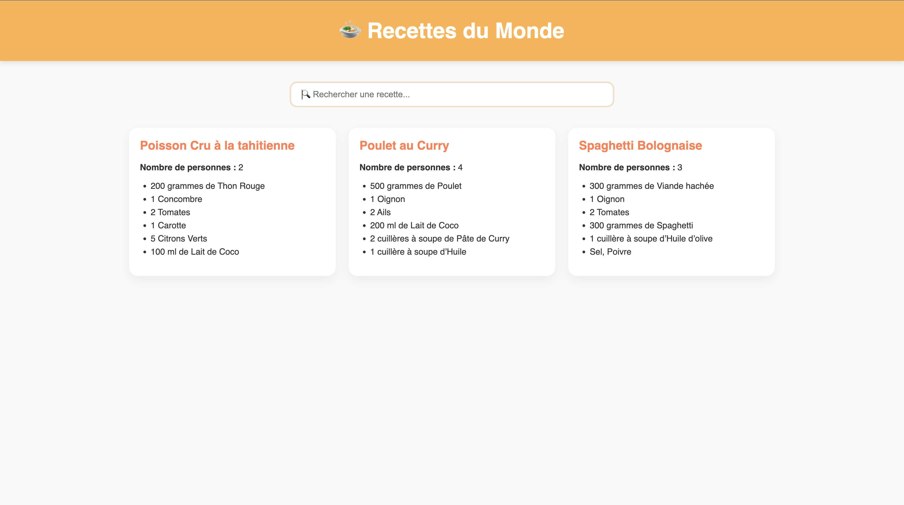

# 🧑‍🍳 Exercice — Recettes du Monde (UI → Dynamique)

## 🎯 Objectif pédagogique

**À partir d’une interface utilisateur statique en HTML/CSS**, vous allez devoir **rendre dynamiques les cartes de recettes** à l’aide de JavaScript.  
Cela vous permettra de valider la compétence suivante :

> ✅ **Compétence visée** : _Développer une interface utilisateur web dynamique_

---

## 💻 Étapes à réaliser

1. **Observer la structure HTML/CSS existante** dans `index.html` et `styles.css`.
2. Supprimer ou commenter les sections `<section class="recipe-card">...</section>` dans `index.html`.
3. Utiliser **JavaScript** (dans un fichier `script.js` que vous relierez à votre page) pour :
   - Charger dynamiquement les données depuis un fichier `recettes.json` via **`fetch` + `async/await`**
   - Créer les éléments HTML correspondants en JavaScript
   - Les insérer dans le DOM dans la grille `.recipes-grid`

---

## maquette

# Recette-monde

## Authors

- [@bryanParisot](https://github.com/BryanParisot)
